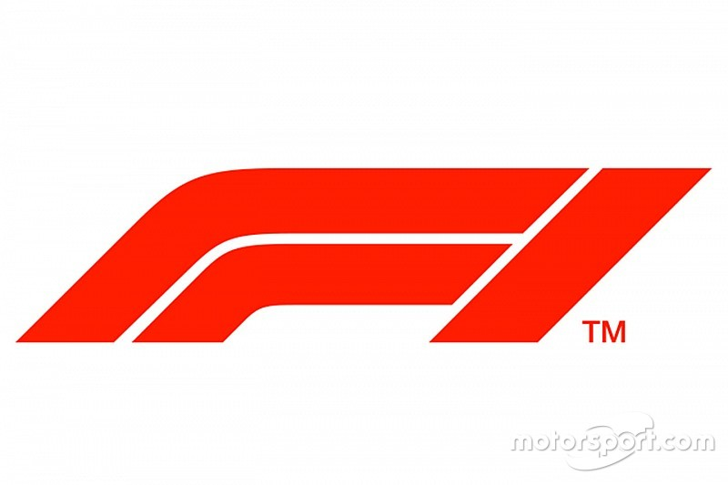
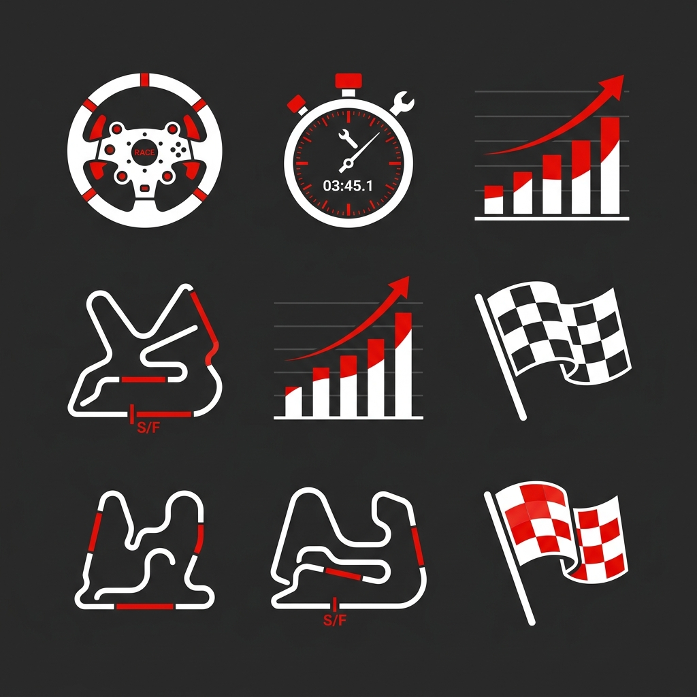

<div align="center">

<!-- HERO BANNER -->


<br/>

<!-- F1 LOGO -->


<br/><br/>

# 🏎️ Formula 1 Race Strategy Intelligence

### _Decoding the Science Behind Every Pit Call, Grid Slot & Championship Point_

<br/>

**National School of Technology** &nbsp;·&nbsp; DVA Capstone Project &nbsp;·&nbsp; Gate 1 &nbsp;·&nbsp; Section A, Group 4

<br/>

[](https://python.org)
[](https://jupyter.org)
[](https://tableau.com)
[](https://www.kaggle.com/datasets/jtrotman/formula-1-race-data)
[](#)

<br/>



</div>

<br/>

---

<br/>

## 📋 &nbsp; Project Overview

> **In Formula 1, races are won and lost in the data — not just on the track.**

This repository contains the comprehensive data analysis and visualization for the **Formula 1 Race Strategy Intelligence** project. This study examines the multi-faceted determinants of race outcomes, moving beyond raw car performance to evaluate how **strategic execution** — including qualifying precision, pit stop efficiency, and circuit-specific tactics — influences a constructor's position in the Championship standings.

<br/>

---

<br/>

## 📑 &nbsp; Master Documentation

<div align="center">

| &nbsp; | Document | Description |
| :---: | :--- | :--- |
| 📄 | [**Master Project Document**](https://docs.google.com/document/d/1rMlTm188s5ELVhODmY1sF_PMzNEJwIwD1xeBISw3xlI/edit?tab=t.0) | Centralized repository for project progress and deep analysis notes. |
| 📝 | [**Gate 1 Project Proposal**](https://docs.google.com/document/d/1hgF-8RlZUbNi2d4QI_K483mzBwbZpYF8/edit?usp=sharing&ouid=103256623304686024418&rtpof=true&sd=true) | Formal Gate 1 submission — problem statement, methodology & dataset quality. |

</div>

<br/>

---

<br/>

## 🔍 &nbsp; Technical Problem Statement

### Sector: Motorsport & Predictive Analytics

<details>
<summary><b>📌 Contextual Background</b> — <i>click to expand</i></summary>
<br/>

Formula 1 constructors inhabit a **hyper-competitive, data-saturated environment**. For mid-field teams (typically finishing between 4th and 7th in the Constructors' Championship), technical development budgets are often dwarfed by front-running teams. Consequently, **tactical optimization** — specifically regarding pit stop strategy and circuit-specific maneuvers — becomes the primary differentiator for maximizing season points and associated prize allocations.

</details>

<br/>

### 🎯 &nbsp; Core Business Question

> *What is the measurable impact of starting grid position, pit stop efficiency (duration and frequency), and circuit topography on a driver's final classification? Furthermore, which controllable strategic variables should a mid-field constructor prioritize to optimize point accumulation across a diverse racing calendar?*

<br/>

### ⚡ &nbsp; Strategic Decision Support

This analysis is designed to empower **Race Strategists** to:

| # | Objective | Description |
| :---: | :--- | :--- |
| 🔧 | **Optimize Pit Strategy** | Determine the statistical efficacy of one-stop vs. two-stop strategies across various circuit categories. |
| 💰 | **Resource Allocation** | Quantify the "Points Dividend" of pit crew efficiency improvements versus marginal gains in qualifying pace. |
| 📊 | **Benchmarking** | Evaluate the "Grid-to-Finish" performance delta against direct competitors to identify operational strengths and weaknesses. |

<br/>

---

<br/>

## 👥 &nbsp; Team Composition

<div align="center">

| Role | Name | GitHub |
| :--- | :--- | :---: |
| 🏆 **Project Lead** | Mitul Bhatia | [](https://github.com/mitul-bhatia) |
| 📊 **Data Lead** | Ramani Dhruv Dineshbhai | [](https://github.com/DhruvR-16) |
| ⚙️ **ETL Lead** | Vetriselvan R | [](https://github.com/Vetri-78640) |
| 🔬 **Analysis Lead** | Agrim Kumar Malhotra | [](https://github.com/Agrim-2007) |
| 🎨 **Visualization Lead** | Kushal Sarkar | [](https://github.com/Kushal425) |
| 🧠 **Strategy Lead** | Ritik Ranjan | [](https://github.com/ritik-beep) |
| 📋 **PPT & Quality Lead** | Palaparthi Harshakarthikeya | [](https://github.com/HARSHAKARTHIKEYA1510) |

</div>

<br/>

---

<br/>

## 🗄️ &nbsp; Dataset Methodology

<div align="center">

[-E10600?style=for-the-badge)](https://www.kaggle.com/datasets/jtrotman/formula-1-race-data)

</div>

<br/>

### Data Analytics Profile

<div align="center">

| Metric | Value |
| :--- | :--- |
| **Total Observations** | `726,600+` records across 14 relational entities |
| **Temporal Coverage** | 1950 — 2026 _(76 full seasons)_ |
| **Dimensionality** | `111` unique attributes |
| **Key Variables** | `grid` · `position` / `points` · `milliseconds` · `circuitId` |

</div>

<br/>

---

<br/>

## 📈 &nbsp; Preliminary Analytical Framework

### Key Performance Indicators (KPIs)

<table>
  <tr>
    <td width="50%">

**1 · Grid-to-Finish Excellence Delta**

```
Δ = Grid Position − Final Finishing Position
```

Isolates **race-day execution** from pure qualifying pace. A positive Δ indicates positions gained during the race.

</td>
    <td width="50%">

**2 · Operational Efficiency Score**

```
OES = Σ(avg pit stop duration) / season
```

A seasonally aggregated measure of average pit stop duration per constructor — tests correlation between mechanical speed and championship points.

</td>
  </tr>
</table>

<br/>

### 💡 &nbsp; Hypothesized Insights

> We anticipate that **qualifying position** will remain the dominant predictor of outcome on high-downforce, low-overtaking circuits. Conversely, on **power-sensitive circuits** with high overtaking frequency, pit stop strategy and efficiency will play a disproportionately larger role in determining final classification.

<br/>

---

<br/>

## 🏗️ &nbsp; Project Architecture

```
📂 Sec-A_g-4_F1_Race_Strategy_Intelligence/
│
├── 📁 data/
│   ├── raw/                              # Original Ergast F1 dataset files
│   └── processed/                        # Cleaned and engineered feature sets
│
├── 📁 notebooks/
│   ├── 01_extraction.ipynb               # API/CSV data ingestion workflows
│   ├── 02_cleaning.ipynb                 # Handling missing values & schema alignment
│   ├── 03_eda.ipynb                      # Exploratory analysis & pit stop benchmarking
│   ├── 04_statistical_analysis.ipynb     # Hypothesis testing & predictive modeling
│   └── 05_final_load_prep.ipynb          # Final prep for Tableau integration
│
├── 📁 scripts/
│   └── etl_pipeline.py                   # Automated data processing scripts
│
├── 📁 tableau/
│   ├── screenshots/                      # Visual previews of dashboard components
│   └── dashboard_links.md                # Access URLs for interactive Tableau workbooks
│
├── 📁 docs/
│   └── data_dictionary.md                # Detailed mapping of relational variables
│
├── 📁 reports/
│   ├── project_report.pdf                # Comprehensive technical documentation
│   └── presentation.pdf                  # Stakeholder presentation deck
│
├── 📁 DVA-focused-Portfolio/              # Project-specific portfolio assets
├── 📁 DVA-oriented-Resume/               # Resume tailored for Data Analytics roles
├── 📁 assets/                            # Logo, banner & visual assets
│
└── 📄 README.md                          # ← You are here
```

<br/>

---

<br/>

<div align="center">


<br/><br/>

**Built with precision. Driven by data.**

<sub>© 2026 Formula 1 Race Strategy Intelligence Team · National School of Technology · All Rights Reserved.</sub>

<br/><br/>

[](#)

</div>
